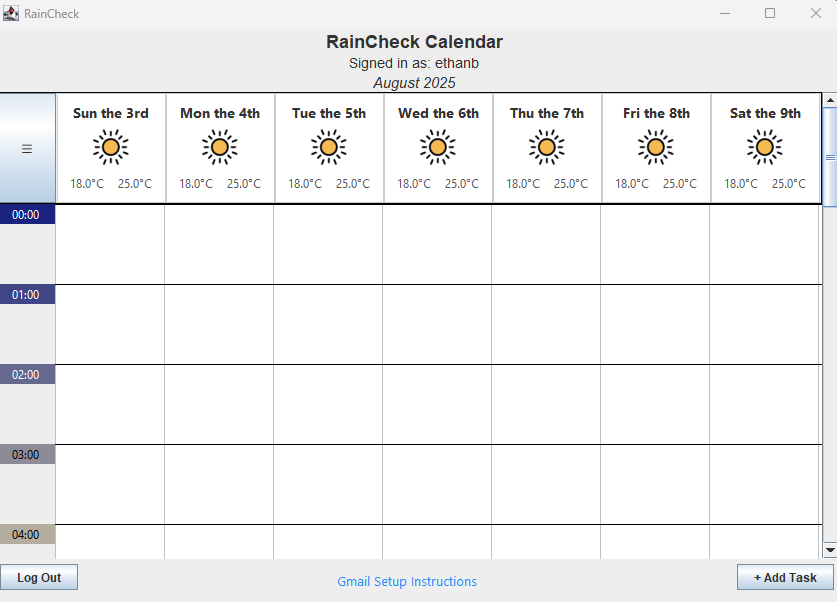
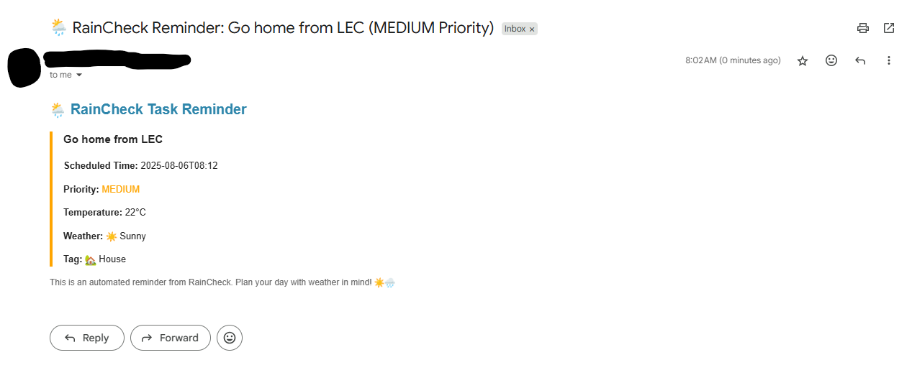
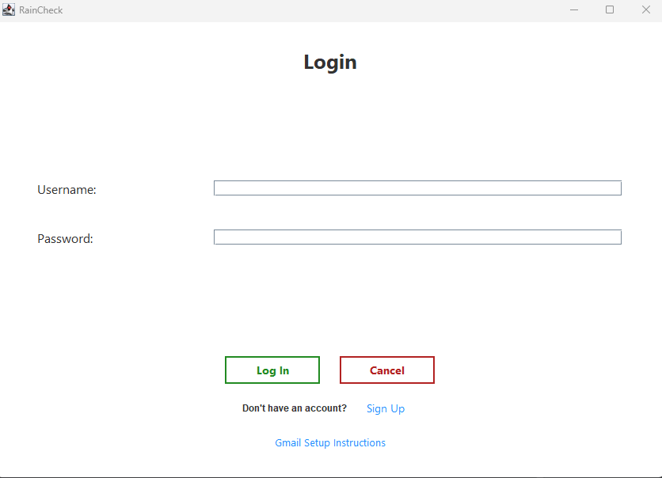
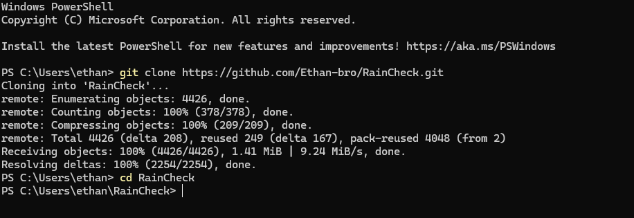
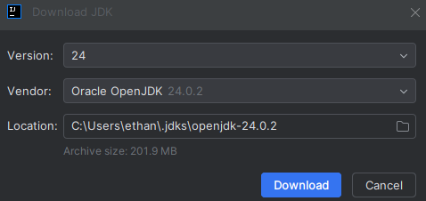
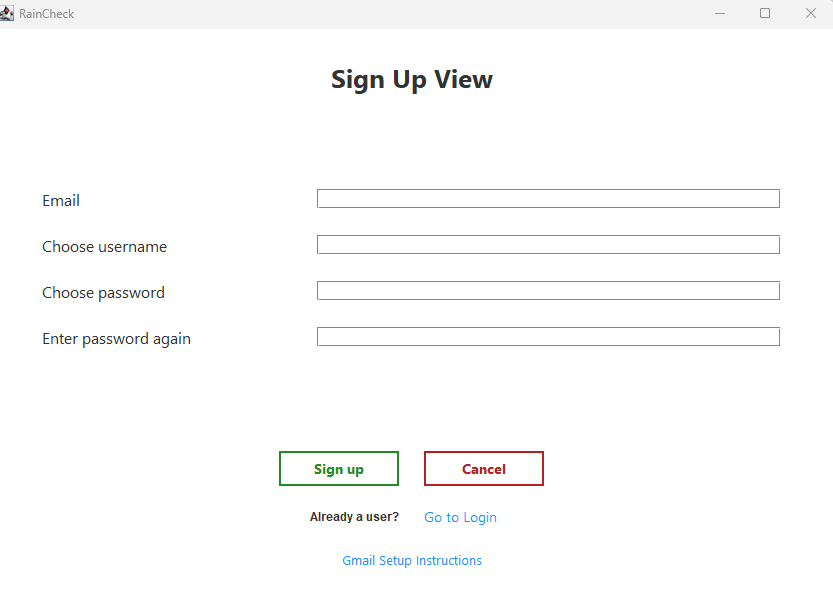

# <p align="center"><b>RainCheck</b></p>

> ⚠️ **Note:** All screenshots were taken during development. Some UI elements may differ slightly from the final version, but the core features and layout remain the same.

## Table of Contents

- [Project Summary](#project-summary)
- [Authors and Contributors](#authors-and-contributors)
- [Features](#features)
- [Installation](#installation)
- [Usage](#usage)
- [License](#license)
- [Feedback](#feedback)
- [Contributing](#contributing)

## Project Summary

**RainCheck** is a desktop task planner built with Java Swing that helps users organize their week by combining their personal schedule with live hourly weather forecasts.

Traditional task planners ignore weather, but RainCheck bridges this gap by integrating forecast data directly into a visual week-view calendar. This helps users make informed decisions about when to schedule outdoor activities, avoid weather disruptions, and better prioritize tasks.

Users can create, edit, and delete tasks — each with customizable priority levels, tag names and emojis, reminders, and embedded weather info. All tasks persist across sessions and are tied to secure personal accounts.

RainCheck is useful for anyone who wants to manage time more effectively while staying aware of changing weather conditions that could affect their plans.

## Authors and Contributors

- **Ethan** – User Authentication & Account Management
- **Brad** – Task Creation, Reminder Class & Priority Management
- **Sean** – Custom Tag System (`tagName`, `tagEmoji`)
- **Clara** – Task Editing, Deletion, Completion UI
- **Kian** – Reminder Logic, Notification Feature Design
- **Team** – Weekly Weather View, Weather-Integrated Calendar, Core Architecture, UI Enhancement

## Features

RainCheck helps users plan tasks around real-world weather. Key features include:

##### 1. Weather-Aware Calendar
 - View daily weather for a week-view calendar. 
 - Weather remains visible as tasks are added, edited, or removed.
 - View hourly weather per task by clicking on the task box in the calendar at any point during the program.

<div align="center">
  
</div>

##### 2. Smart Task Management
Create, edit, and delete tasks with:

- **Priority levels (High, Medium, Low) shown by color**
- **Custom tag names and emojis (e.g., Workout 💪)**
- **Weather info at task time (e.g., ☀️ 23°C)**
- **Optional reminders and completion status**

<div align="center">
  <a href="https://www.youtube.com/watch?v=cbo1l0AgY7o" target="_blank" rel="noopener noreferrer">
    Watch Task Management Demo on YouTube
  </a>
</div>

##### 3. Reminder Notifications
<div align="center">
  Set alerts (10, 30, or 60 mins before) that notify users via email.
</div>

<div align="center">
  
  
</div>

##### 4. Custom Tags
Create/Edit/Delete tasks using dropdown tag names and emojis.
<div align="center">
  <a href="https://www.youtube.com/watch?v=GdjuhhC6-yw" target="_blank" rel="noopener noreferrer">
    Watch Custom Tags Demo on YouTube
  </a>
</div>

##### 5. Secure User Accounts
Users sign up and log in to access their saved tasks and personalized forecasts.

<div align="center">
  
</div>

## Installation

Follow these steps to clone, build, and run RainCheck.

### Java Prerequisite

RainCheck requires Java JDK 17 or later to build and run.

To simplify setup, we recommend using an IDE that includes a bundled JDK 17 or higher, such as recent versions of IntelliJ IDEA or Eclipse. This way, you won’t need to install Java separately on your system.

If your IDE does not include a bundled JDK or you want to use a specific Java version, you will need to install Java JDK 17+ manually. 

Throughout this README, we use IntelliJ IDEA which does include a bundled JDK 17 or higher.

### 1. Clone the Repository
Open a terminal and run:
```bash
git clone https://github.com/Ethan-bro/RainCheck.git
cd RainCheck
```
<div align="center">
  
</div>

### 2. Configure Secrets

RainCheck requires API keys to access external services like Supabase and Visual Crossing Weather.

- A sample `config/secrets.json` file is **already included** in the repo to make setup easy.
- You **must** replace `"weather_api_key"` with your own if the app fails to load weather (1000 free API calls/month).

```json
{
  "database_url": "https://jbjoxiauljridpmnunuh.supabase.co",
  "database_anon_key": "eyJhbGciOiJIUzI1NiIsInR5cCI6IkpXVCJ9...",
  "weather_api_key": "{your_own_key_here}"
}
```

> **Why is this file public?**  
> The `secrets.json` file is public in this repo because:
> - Our database and weather keys are used in class for development and demo purposes.
> - We frequently reset the backend, so long-term security isn’t a concern.
> - This simplifies setup for teammates and TAs who are testing or marking the project.
> **How should *you* handle secrets?**
> If you're building your own version or using your own backend:
> - **Do NOT commit secrets** to GitHub — add `config/secrets.json` to your `.gitignore`
> - **Create the file locally** and keep it private
> - **Use environment variables** where possible (e.g., `.env` files + a dotenv library)

### 3. Run the Project (using an IDE)
Open the project in IntelliJ IDEA, Eclipse, or your preferred Java IDE and run the `Main` class.

IntelliJ may prompt you to configure the JDK if it's not set up yet.  
To do this:

1. Go to `File` → `Project Structure` → `Project`
2. Under `Project SDK`, click the dropdown and select `Download JDK`
3. Choose your desired JDK version (Java 17 or later) and install it
4. Click `Apply` and then `OK` after download completes

<div align="center">
  
</div>

After the SDK is set up, simply run the `Main.java` class to launch RainCheck.
> `Main.java` is located at `RainCheck/src/main/java/app/Main.java`.

At the time of writing this readme, the program runs successfully and looks like: 

<div align="center">
  
</div>

✅ If everything works, RainCheck will launch and display the weekly calendar interface. You can now continue to the [Usage](#usage) section to explore how to use the app.

❌ If you get any errors, check the [Troubleshooting](#troubleshooting) and [Common Installation Issues & Fixes](#common-installation-issues--fixes) sections below for solutions to the most common problems.

# Troubleshooting

## System Compatibility
RainCheck is compatible with:
- Windows - fully supported
- macOS - fully supported
- Linux - may work but untested (check Java 17+ configuration)

Note for macOS/Linux: Verify IDE uses Java 17+ with matching compiler

## Common Installation Issues & Fixes

### Git Clone Fails

Symptom: When running
```bash
git clone https://github.com/Ethan-bro/RainCheck.git
```
You receive the error:
```bash
fatal: repository 'https://github.com/Ethan-bro/RainCheck.git/' not found
```
Fixes:
1. Verify the repository URL:
 - Check for typos in the URL
 - Remove any extra characters like quotes or trailing slashes
 - Verify the repository exists and is public
 - Correct URL should be: https://github.com/Ethan-bro/RainCheck.git
2. Check your internet connection:
 - Ensure you have stable internet access
 - Try accessing ```github.com``` in your browser
3. Try SSH cloning instead:
```bash
git clone git@github.com:Ethan-bro/RainCheck.git
```

> Notes:
> First-time GitHub users may need to set up Git credentials
> Corporate networks might block Git operations

### Java SDK Missing

Symptom: 'No SDK' errors in IntelliJ <br />
Fix:
1. File > Project Structure > Project
2. Set SDK to JDK 17 (or higher). Download if missing
3. Apply changes

For detailed JDK setup instructions with visual guidance, see: <br />
[Setting Up Java JDK/SDK](#3-run-the-project-using-an-ide)

### `secrets.json` Problems

Symptom: Signup/Login and weather retrieval features don't work  
Fix: Ensure the file exists in `config/secrets.json` with the following structure:

```json
{
  "database_url": "https://jbjoxiauljridpmnunuh.supabase.co",
  "database_anon_key": "eyJhbGciOiJIUzI1NiIsInR5cCI6IkpyaW...",
  "weather_api_key": "{your_weather_api_key}"
}
```

If you experience issues with weather data not loading correctly, check the USE_FAKE_DATA variable in
`src/main/java/data_access/WeatherApiService.java`. <br />

This variable controls whether RainCheck fetches real weather data from the API or uses fake (mock) data for testing and offline development.
 - When `USE_FAKE_DATA` is set to `false` (default), RainCheck fetches live weather data using your API key from `secrets.json`.
 - When set to `true`, the app uses pre-defined fake weather data, which is useful for faster testing or when offline.
Make sure to set this variable according to your needs and verify that your API key in secrets.json is valid to avoid errors.

## Common IntelliJ IDEA Issues & Fixes
### 1. **Project Build or Compilation Errors**
**Symptom:** Errors during build or run, even though the code seems correct.
**Fix:** Follow this tutorial to resolve common build issues in IntelliJ IDEA:
[How to fix common errors in IntelliJ](https://www.youtube.com/watch?v=hbXsdKGG0Pg&ab_channel=BitsNBytes)

### 2. **Running the Application: Errors or Blank Screen**
**Symptom:** Application doesn't start or shows a blank screen.
**Fix:** Ensure all configurations are correct and dependencies are properly set up. <br />
Refer to the tutorials above for detailed guidance.

---

## Usage

RainCheck launches into a weekly calendar where you can create, edit, and manage weather-aware tasks and tags for tasks.

### Visual Demo (TODO)

To demonstrate how the app works, include:

- A short **video or GIF** showing:
  - Adding a task
  - Viewing weather and UV info
  - Editing, deleting, and marking tasks as complete

**TODO:** Add visual walkthrough here for submission.
