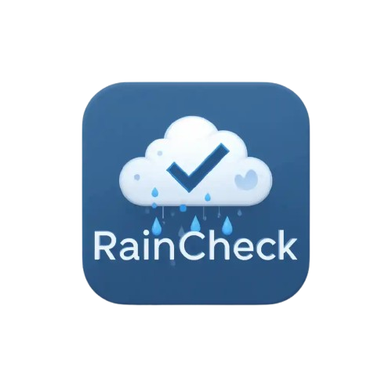

  

<h1 align="center">RainCheck</h1>

  RainCheck is a Java Swing app that helps users plan their day by linking tasks with real-time weather forecasts in a calendar-style interface. Built using Clean Architecture, the app promotes modular, scalable, and testable code practices.

---

## 🌦️ Domain: Weather-Aware Task Planning

RainCheck helps users schedule and manage daily tasks while providing context-aware weather data. Hourly forecasts are displayed in a timeline that persists regardless of task updates. Tasks and weather are visually aligned for smarter planning.

---

## 🧩 Software Specification

- Calendar-style timeline with **hourly weather forecasts**
- **Tasks appear beside the forecast** at their scheduled hour
- Weather display remains constant, even if tasks are edited or deleted
- Tasks can be:
  - ✅ **Created, edited, deleted, or marked as completed**
  - 🏷️ Assigned a **priority** (High, Medium, Low)
  - 🧠 Tagged with a **custom name + emoji**
- Secure **account-based login system** using local file storage
- Weather data fetched from the **Visual Crossing Weather API**
- Personalized task list and weather context are loaded on login

---

## 👥 User Stories

- **[Team Story]** George sees a calendar with hourly weather forecasts. As he adds tasks, they appear next to the relevant hour. If he deletes or reschedules a task, the weather remains unchanged.

- **[Kian’s Story]** Based on a task’s priority, its display color changes to help George distinguish urgent items from less critical ones.

- **[Sean’s Story]** Users can create custom tags (e.g., 📚 School, 🏋️ Gym) with a name and an emoji chosen from a dropdown. Tags improve task categorization.

- **[Brad’s Story]** George adds tasks manually or using voice-to-text, which transcribes and previews input before saving. He can also assign priority levels when creating or editing tasks.

- **[Clara’s Story]** George wants to edit, delete, and mark tasks as done. This helps him stay on track and organized.

- **[Ethan’s Story]** George creates an account and logs in using a username and password. His tasks and weather preferences are saved securely.

---

## 📦 Domain Model: Proposed Entities

| **Entity**         | **Attributes / Description**                                                                  |
|--------------------|-----------------------------------------------------------------------------------------------|
| `User`             | `username`, `password`                                                                        |
| `Task`             | `title`, `scheduledDateTime`, `isCompleted`, `temperature`, `priority`, `displayColor`, `tag` |
| `Tag`              | `tagName`, `tagEmoji` (e.g., `"📚"`)                                                          |

---

## 🌐 Weather API Integration

- Uses the **Visual Crossing Weather API** for hourly weather data
- Supports temperature, conditions, precipitation, wind, and icon imagery
- Data is fetched via **Java HTTP requests**
- Supports **JSON response format**
- Up to **1,000 free API calls/day** under the free tier
- Weather is parsed and mapped to `WeatherForecast` entities

---

## 🧪 Project Focus by Feature/Member

| **Member** | **Feature Responsibility**                                                           |
|------------|--------------------------------------------------------------------------------------|
| Ethan      | User account creation and login                                                      |
| Brad       | Task input methods including manual entry                                            |
| Kian       | Task priority visualization with dynamic color coding for urgency                    |
| Sean       | Custom task tags with name and emoji selection from dropdown                         |
| Clara      | Task management: editing, deleting, and marking tasks as completed                   |
| Team       | Display of hourly weather forecasts and integration with Visual Crossing Weather API |

---

## 📅 Group Coordination

- **Meeting Time**: Thursdays, 5–6 PM (before tutorial)
- **Communication**: Instagram group chat + in-person meetings
